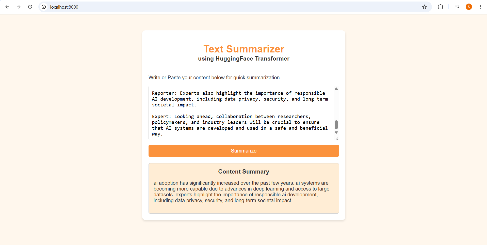

# Text Summarizer App

## 📌 Overview

The **Text Summarizer App** is an AI-powered web application that generates short and meaningful summaries from long text. It helps users quickly understand the main ideas of articles, reports, documents, and other text while saving time and improving productivity.

## ✨ Features

- Summarize long text into concise summaries.
- Simple and user-friendly interface.
- Fast and accurate AI-generated summaries.
- Copy summarized text with one click.
- Responsive design for desktop and mobile.

## 🛠️ Tech Stack

- **Frontend:** HTML, CSS, JavaScript
- **Backend:** Python
- **Framework:** Flask
- **AI Model:** OpenAI GPT API
- **Version Control:** Git & GitHub

## 📸 Output

## 📖 How to Use

1. Open the application.
2. Paste or type the text you want to summarize.
3. Click the **Summarize** button.
4. View and copy the generated summary.

## 🎯 Project Objective

The objective of this project is to build an AI-based application that simplifies reading by generating concise summaries while preserving the main meaning of the original text.

## 📌 Future Enhancements

- Upload PDF, DOCX, and TXT files.
- Support multiple languages.
- Adjustable summary length.
- Download summaries as PDF or TXT.
- User authentication and history.
